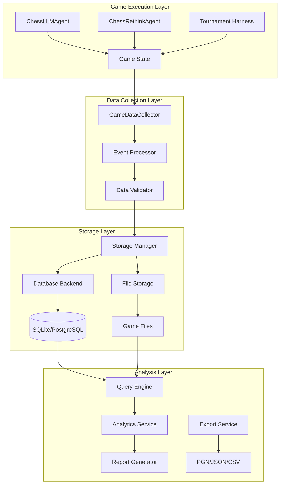

# Design Document

## Overview

The Game Data Storage system will provide comprehensive data persistence and analytics capabilities for the Game Arena chess tournament platform. The system will capture detailed information about games, moves, player performance, and LLM behavior patterns while maintaining minimal impact on game execution performance.

The design follows a layered architecture with clear separation between data collection, storage, and analysis components. The system will integrate seamlessly with existing Game Arena components through a non-intrusive observer pattern that captures game events without modifying core game logic.

## Architecture

### High-Level Architecture



### Component Interaction Flow

1. **Game Events**: Agents and tournament harness emit events during game execution
2. **Data Collection**: GameDataCollector captures events and processes them asynchronously
3. **Storage**: Processed data is stored in database with file attachments for large objects
4. **Analysis**: Query engine provides access to stored data for analytics and reporting

## Components and Interfaces

### GameDataCollector

The central component responsible for capturing game events and coordinating data storage.

```python
class GameDataCollector:
    def __init__(self, storage_manager: StorageManager, config: CollectorConfig)
    
    # Core event capture methods
    def start_game(self, game_id: str, players: Dict[int, PlayerInfo], metadata: GameMetadata) -> None
    def record_move(self, game_id: str, move_data: MoveData) -> None
    def end_game(self, game_id: str, outcome: GameOutcome) -> None
    
    # Agent integration hooks
    def create_agent_wrapper(self, agent: KaggleSpielAgent) -> DataCollectingAgent
    def register_tournament_hooks(self, tournament_runner: Any) -> None
```

### StorageManager

Handles database operations and provides abstraction over different storage backends.

```python
class StorageManager:
    def __init__(self, backend: StorageBackend, config: StorageConfig)
    
    # Game operations
    def create_game(self, game_data: GameRecord) -> str
    def update_game(self, game_id: str, updates: Dict[str, Any]) -> None
    def get_game(self, game_id: str) -> GameRecord
    
    # Move operations
    def add_move(self, game_id: str, move: MoveRecord) -> None
    def get_moves(self, game_id: str, filters: MoveFilters = None) -> List[MoveRecord]
    
    # Player operations
    def update_player_stats(self, player_id: str, stats: PlayerStats) -> None
    def get_player_stats(self, player_id: str) -> PlayerStats
    
    # Query operations
    def query_games(self, filters: GameFilters) -> List[GameRecord]
    def get_analytics(self, query: AnalyticsQuery) -> AnalyticsResult
```

### QueryEngine

Provides high-level query interface for data analysis and reporting.

```python
class QueryEngine:
    def __init__(self, storage_manager: StorageManager)
    
    # Game queries
    def get_games_by_players(self, player1: str, player2: str) -> List[GameRecord]
    def get_games_by_date_range(self, start: datetime, end: datetime) -> List[GameRecord]
    def get_games_by_outcome(self, outcome: GameOutcome) -> List[GameRecord]
    
    # Performance analytics
    def get_player_winrate(self, player_id: str, opponent: str = None) -> float
    def get_move_accuracy_stats(self, player_id: str) -> MoveAccuracyStats
    def get_illegal_move_rate(self, player_id: str) -> float
    
    # Tournament analytics
    def get_tournament_summary(self, tournament_id: str) -> TournamentSummary
    def generate_leaderboard(self, criteria: LeaderboardCriteria) -> List[PlayerRanking]
```

## Data Models

### Core Game Data

```python
@dataclass
class GameRecord:
    game_id: str
    tournament_id: Optional[str]
    start_time: datetime
    end_time: Optional[datetime]
    players: Dict[int, PlayerInfo]  # 0: Black, 1: White
    initial_fen: str
    final_fen: Optional[str]
    outcome: Optional[GameOutcome]
    termination_reason: Optional[str]
    total_moves: int
    game_duration_seconds: Optional[float]
    metadata: Dict[str, Any]

@dataclass
class PlayerInfo:
    player_id: str
    model_name: str
    model_provider: str
    agent_type: str  # "ChessLLMAgent", "ChessRethinkAgent"
    agent_config: Dict[str, Any]
    elo_rating: Optional[float]

@dataclass
class GameOutcome:
    result: str  # "1-0", "0-1", "1/2-1/2", "*"
    winner: Optional[int]  # 0 or 1, None for draw
    termination: str  # "checkmate", "stalemate", "resignation", "timeout", "error"
```

### Move Data

```python
@dataclass
class MoveRecord:
    game_id: str
    move_number: int
    player: int  # 0 or 1
    timestamp: datetime
    
    # Game state
    fen_before: str
    fen_after: str
    legal_moves: List[str]
    
    # Move information
    move_san: str  # Standard Algebraic Notation
    move_uci: str  # Universal Chess Interface notation
    is_legal: bool
    
    # LLM interaction data
    prompt_text: str
    raw_response: str
    parsed_move: Optional[str]
    parsing_success: bool
    parsing_attempts: int
    
    # Timing data
    thinking_time_ms: int
    api_call_time_ms: int
    parsing_time_ms: int
    
    # Rethink data (if applicable)
    rethink_attempts: List[RethinkAttempt]
    
    # Quality metrics
    move_quality_score: Optional[float]  # From chess engine analysis
    blunder_flag: bool
    
    # Error information
    error_type: Optional[str]
    error_message: Optional[str]

@dataclass
class RethinkAttempt:
    attempt_number: int
    prompt_text: str
    raw_response: str
    parsed_move: Optional[str]
    was_legal: bool
    timestamp: datetime
```

### Analytics Data

```python
@dataclass
class PlayerStats:
    player_id: str
    games_played: int
    wins: int
    losses: int
    draws: int
    win_rate: float
    average_game_length: float
    illegal_move_rate: float
    average_thinking_time: float
    elo_rating: float
    last_updated: datetime

@dataclass
class MoveAccuracyStats:
    total_moves: int
    legal_moves: int
    illegal_moves: int
    parsing_failures: int
    average_rethink_attempts: float
    blunder_rate: float
    accuracy_percentage: float
```

## Error Handling

### Error Categories

1. **Storage Errors**: Database connection failures, disk space issues
2. **Data Validation Errors**: Invalid game states, malformed move data
3. **Performance Errors**: Timeout during data collection, memory constraints
4. **Integration Errors**: Agent wrapper failures, tournament hook issues

### Error Handling Strategy

```python
class GameDataError(Exception):
    """Base exception for game data storage errors."""
    pass

class StorageError(GameDataError):
    """Database or file storage related errors."""
    pass

class ValidationError(GameDataError):
    """Data validation failures."""
    pass

class PerformanceError(GameDataError):
    """Performance-related issues."""
    pass
```

### Graceful Degradation

- **Storage Unavailable**: Continue game execution, log errors, queue data for later storage
- **Validation Failures**: Store raw data with error flags, continue processing
- **Performance Issues**: Reduce data collection granularity, prioritize critical data
- **Integration Failures**: Fall back to minimal data collection, maintain game functionality

## Testing Strategy

### Unit Testing

- **Data Models**: Validation, serialization, edge cases
- **Storage Operations**: CRUD operations, transaction handling, error conditions
- **Query Engine**: Filter logic, aggregation accuracy, performance
- **Event Processing**: Data transformation, validation, error handling

### Integration Testing

- **Agent Integration**: Verify data collection doesn't affect game behavior
- **Database Integration**: Test with SQLite and PostgreSQL backends
- **Tournament Integration**: End-to-end game data capture and storage
- **Performance Testing**: Concurrent games, large datasets, query performance

### Test Data Strategy

```python
# Test fixtures for consistent testing
@pytest.fixture
def sample_game_data():
    return GameRecord(
        game_id="test_game_001",
        tournament_id="test_tournament",
        start_time=datetime.now(),
        players={
            0: PlayerInfo("player_black", "gpt-4", "openai", "ChessLLMAgent", {}),
            1: PlayerInfo("player_white", "gemini-pro", "google", "ChessRethinkAgent", {})
        },
        initial_fen="rnbqkbnr/pppppppp/8/8/8/8/PPPPPPPP/RNBQKBNR w KQkq - 0 1",
        # ... other fields
    )

@pytest.fixture
def sample_move_data():
    return MoveRecord(
        game_id="test_game_001",
        move_number=1,
        player=1,
        timestamp=datetime.now(),
        fen_before="rnbqkbnr/pppppppp/8/8/8/8/PPPPPPPP/RNBQKBNR w KQkq - 0 1",
        fen_after="rnbqkbnr/pppppppp/8/8/4P3/8/PPPP1PPP/RNBQKBNR b KQkq e3 0 1",
        move_san="e4",
        move_uci="e2e4",
        is_legal=True,
        # ... other fields
    )
```

### Performance Testing

- **Concurrent Game Handling**: Test with 10+ simultaneous games
- **Large Dataset Queries**: Test with 10,000+ games and 500,000+ moves
- **Storage Performance**: Measure write/read latency under load
- **Memory Usage**: Monitor memory consumption during extended tournaments